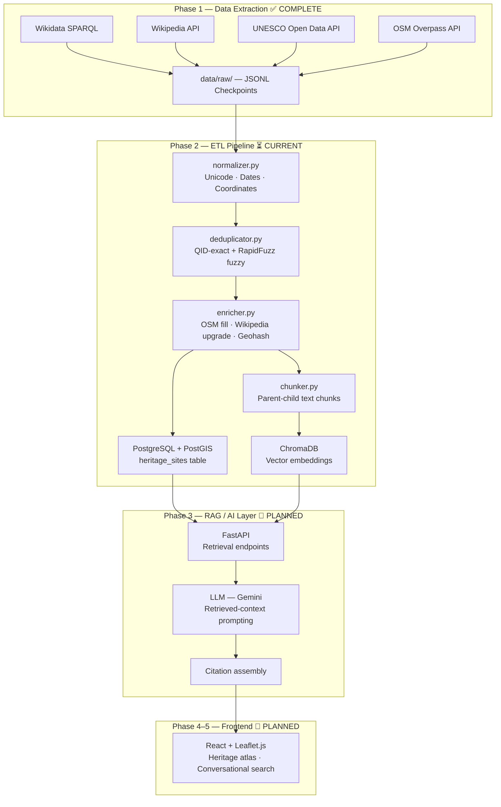

# Echolore · Arkana

> **AI-Powered Heritage Knowledge Platform for India**

[](https://www.python.org/)
[](#project-status)
[](#project-status)
[](#data-licenses)

---

## Project Overview

**Echolore** (internal codename: **Arkana**) is a Retrieval-Augmented Generation (RAG) platform for exploring India's cultural heritage through citation-grounded conversations and an interactive geographic atlas.

### The Problem

India has one of the world's richest and most diverse heritage landscapes — over 37,000 documented monuments and sites. Yet reliable, machine-readable knowledge about most of them is scattered across dozens of sources of uneven quality. Existing AI systems either hallucinate answers from unchecked pretrained knowledge, or require expensive expert curation for every site.

### Why RAG?

RAG solves both problems at once. Instead of relying on an LLM's internal memory, every answer Echolore produces is derived from **retrieved, verified evidence**:

- A user asks *"What is the architectural significance of Hampi?"*
- The system retrieves the relevant Wikipedia sections, Wikidata structured metadata, and UNESCO designation record
- The LLM synthesises a grounded answer — with source citations the user can verify

This means the system is transparent, correctable, and does not degrade when LLM knowledge becomes stale.

### End Goal

A publicly accessible web platform where anyone can:
- Ask natural-language questions about any of India's 37,000+ heritage sites
- Explore sites on an interactive geographic atlas
- Read answers with full citations linking back to authoritative sources

---

## Current Features

> Phase 1 is **complete**. The features below are implemented, validated, and production-ready.

- **Wikidata extractor** — SPARQL-based, state-by-state extraction; QID-keyed structured records for ~37k heritage sites (3 states validated; nationwide run ready)
- **Wikipedia extractor** — Full article text fetched via MediaWiki API; section-aware, boilerplate-stripped for RAG
- **UNESCO extractor** — Official Open Data API (`data.unesco.org`); all 44 India World Heritage Sites downloaded with coordinates, inscription year, and heritage criteria; three-tier fallback strategy
- **OSM extractor** — Overpass API coordinate enrichment for Wikidata records missing `P625`; checkpoint fallback for transient 504 errors
- **Canonical data schema** — Pydantic v2 `HeritageSite` model; single source of truth for all records
- **Validation runner** — `python -m ingestion.validate` health-checks all four active sources against live and cached data
- **ETL transformer modules** — `normalizer.py`, `deduplicator.py`, `enricher.py` fully implemented (orchestration not yet run)
- **PostgreSQL / PostGIS schema** — Full production schema with geography columns, FTS index, GiST spatial index, and triggers
- **Text chunker** — Section-aware parent-child chunking (`chunker.py`) for RAG embedding; ready to run

## Future Features

> These items are planned or partially designed but not yet built.

- `pipeline.py` — Orchestrator to wire extract → normalize → dedup → enrich → load end-to-end
- Full 31-state Wikidata extraction run (~37k records)
- ChromaDB vector embedding run over chunked Wikipedia text
- FastAPI retrieval endpoints (similarity search + metadata filters)
- LLM integration (Gemini) with retrieved-context prompting and citation assembly
- React + Leaflet.js interactive heritage atlas frontend
- Scheduled data refresh pipeline

---

## Architecture



### Key Architectural Decisions

| Decision | Outcome | Rationale |
|---|---|---|
| Deduplication key | `wikidata_qid` — exact match first, RapidFuzz fuzzy fallback | QIDs are globally unique, stable, and cross-source |
| UNESCO source | Official Open Data API → Wikidata SPARQL → hardcoded fallback | No auth required; returns all needed fields |
| RAG chunking | Parent-child: full Wikipedia section (parent) + token-windowed segments (children) | Children embed into ChromaDB; parent provides full context on retrieval |
| Vector store (MVP) | ChromaDB | Fastest to deploy; Qdrant / Weaviate migration path is documented |
| OSM role | Coordinate enrichment only — not a primary source | Coverage is inconsistent; used only to fill missing `P625` values |
| data.gov.in | Permanently deprioritised | Shallow metadata; broken API; negligible benefit — see [Data Sources](#data-sources) |

---

## Data Sources

| Source | Role | Auth | Validated Records | Status |
|---|---|---|---|---|
| **Wikidata SPARQL** | Structural backbone — QIDs, coordinates, categories, inception dates, ASI designation | None | ~3,785 (3 states); ~37k estimated full India | ✅ Production-ready |
| **Wikipedia API** | RAG corpus — long-form architectural descriptions, historical narratives, cultural context | User-Agent header only | ~55 articles validated; ~1,000+ in full run | ✅ Production-ready |
| **UNESCO Open Data API** | Ground-truth World Heritage designation — site name, category, criteria, inscription year, coordinates | None | 44 India WHS (37 cultural, 7 natural) | ✅ Production-ready |
| **OSM Overpass API** | Coordinate enrichment for records where Wikidata `P625` is absent | None | ~200–500 nodes (Rajasthan sample) | ✅ Production-ready |
| **data.gov.in** | — | API key | — | 🚫 Investigated & deprioritised |

### Why data.gov.in was excluded

A bounded investigation (June 2026) examined ~17 datasets across 6 keyword searches. Findings:

- All monument datasets contain only: **Monument Name, Location (free text), District** — no coordinates, descriptions, categories, years, or Wikidata QIDs
- Data originates from 2015–2021 parliamentary annexures; no live database
- All known API resource IDs returned HTTP 403/400
- The only unique data point (ASI protection status) is already captured in Wikidata via `P1435`
- **Estimated integration cost: ~4 engineering days. Expected RAG quality improvement: negligible**

**Decision: permanently deprioritised.** The extractors (`datagov_extractor.py`, `datagov_discovery.py`) are retained for historical record. Do not integrate into Phase 2 without new evidence. Full rationale in [`handoff_summary.md`](handoff_summary.md).

---

## Repository Structure

```
echolore/
├── ingestion/                                 # Core ingestion package
│   ├── extractors/                            # Phase 1: Data extraction — COMPLETE
│   │   ├── wikidata_extractor.py              # SPARQL, state-by-state, QID backbone
│   │   ├── wikipedia_extractor.py             # Full article text for RAG corpus
│   │   ├── unesco_extractor.py                # UNESCO Open Data API (v3, three-tier fallback)
│   │   ├── osm_extractor.py                   # Coordinate enrichment, checkpoint fallback
│   │   ├── wikimedia_commons_extractor.py     # Image URLs + attribution (future enrichment)
│   │   ├── datagov_extractor.py               # data.gov.in — DEPRIORITISED, do not integrate
│   │   └── datagov_discovery.py               # Investigation tool — investigation COMPLETE
│   ├── transformers/                          # Phase 2: ETL — IMPLEMENTED, not yet run
│   │   ├── normalizer.py                      # Unicode/NFKC, ISO dates, coordinate validation
│   │   ├── deduplicator.py                    # Two-tier dedup: QID-exact + RapidFuzz fuzzy
│   │   └── enricher.py                        # Cross-source fill, geohash, related entities
│   ├── models/
│   │   └── heritage_schema.py                 # Pydantic v2 HeritageSite — canonical schema
│   ├── utils/
│   │   ├── chunker.py                         # Section-aware parent-child text chunker
│   │   ├── http_client.py                     # Rate-limited async HTTP with retry/jitter
│   │   └── logger.py                          # Structured JSON logging
│   ├── validate.py                            # Phase 1 validation runner
│   └── config.py                              # API keys, rate limits, paths (loaded from .env)
├── data/
│   ├── raw/                                   # JSONL checkpoints committed to git
│   │   ├── wikidata/                          # 3 state checkpoint files
│   │   ├── wikipedia/                         # Validation sample JSONL
│   │   ├── unesco/                            # india_whs_api_raw.json (44 sites)
│   │   └── osm/                               # Rajasthan OSM checkpoint
│   ├── processed/                             # Phase 2 ETL output — .gitignored
│   └── reports/                               # Validation reports — .gitignored
├── docker/
│   └── postgres/init.sql                      # PostgreSQL/PostGIS schema, indexes, triggers
├── app/
│   └── load.py                                # ⚠️ Isolated early experiment (PDF+FAISS) — NOT part of pipeline
├── src/                                       # Frontend — React + Vite (arkana-react)
│   ├── components/                            # UI components (Navbar, cards, modals, transitions)
│   ├── pages/                                 # Route pages (Home, Browse, Explore, Culture, etc.)
│   ├── data/                                  # Static frontend data (artifacts.js)
│   ├── assets/                                # Images and icons
│   ├── App.jsx
│   ├── App.css
│   ├── main.jsx
│   └── index.css
├── public/                                    # Frontend static assets
├── index.html                                 # Vite entry point
├── package.json                               # Frontend dependencies (React, Vite)
├── vite.config.js                             # Vite configuration
├── docker-compose.yml                         # PostgreSQL + PostGIS + Redis + ChromaDB
├── requirements.txt                           # All Python dependencies
├── .env.example                               # Environment variable template — copy to .env
├── echolore_data_strategy.md                  # Full data source evaluation and strategy notes
└── handoff_summary.md                         # Engineering decision log and handoff document
```

---

## Technology Stack

| Layer | Technology | Phase |
|---|---|---|
| Language | Python 3.11+ | All |
| Async HTTP | `aiohttp`, `httpx` | Phase 1 |
| Data validation | Pydantic v2 | Phase 1 |
| SPARQL | `SPARQLWrapper` | Phase 1 |
| Wikipedia | `wikipedia-api` | Phase 1 |
| OSM | `overpy` | Phase 1 |
| Fuzzy dedup | `rapidfuzz` | Phase 2 |
| Geospatial | `pygeohash`, `GeoAlchemy2` | Phase 2 |
| Structured DB | PostgreSQL 16 + PostGIS | Phase 2 |
| Data frames | `pandas`, `polars` | Phase 2 |
| ORM / migrations | SQLAlchemy (async) + Alembic | Phase 2 |
| Vector store | ChromaDB (MVP) | Phase 3 |
| Embeddings | `sentence-transformers` (`paraphrase-multilingual-mpnet-base-v2`) | Phase 3 |
| API backend | FastAPI + Uvicorn | Phase 3 |
| Caching | Redis | Phase 3 |
| Containerisation | Docker Compose | All |
| Frontend | React + Vite (arkana-react) + Leaflet.js (planned) | Phase 4–5 |
| Code quality | Black, Ruff, MyPy | All |

---

## Project Status

### ✅ Phase 1 — Data Extraction & Validation (COMPLETE)

| Component | Status | Validated Output |
|---|---|---|
| Wikidata extractor | ✅ Production-ready | ~3,785 records / 3 states; ~37k estimated nationwide |
| Wikipedia extractor | ✅ Production-ready | ~55 articles, 0% stub rate, 100% QID linkage |
| UNESCO extractor | ✅ Production-ready | 44 WHS records, all with coordinates + inscription year |
| OSM extractor | ✅ Production-ready (w/ caveat) | ~200–500 nodes; 504s handled via checkpoint fallback |
| Validation runner | ✅ Production-ready | `python -m ingestion.validate` |
| Canonical schema | ✅ Production-ready | `ingestion/models/heritage_schema.py` |
| data.gov.in investigation | ✅ Complete — Deprioritised | See `handoff_summary.md` §4 |
| Raw data checkpoints | ✅ Committed | `data/raw/` — 8 checkpoint files |
| Phase 1 documentation | ✅ Complete | `handoff_summary.md`, `echolore_data_strategy.md` |

---

### ⏳ Phase 2 — ETL Pipeline (CURRENT — infrastructure implemented, orchestration not yet run)

All transformer modules are **fully implemented**. The missing piece is `pipeline.py` — the orchestrator that wires them together and runs the full 31-state extraction.

| Component | Status | Notes |
|---|---|---|
| `normalizer.py` | ✅ Implemented | Unicode/NFKC, coordinate validation, ISO date parsing, category inference |
| `deduplicator.py` | ✅ Implemented | QID exact-match + RapidFuzz fuzzy (threshold 90), quality-score merge |
| `enricher.py` | ✅ Implemented | OSM coord fill, Wikipedia upgrade, geohash, related entity extraction |
| `chunker.py` | ✅ Implemented | Parent-child chunking, 500-token windows, boilerplate removal |
| PostgreSQL schema | ✅ Implemented | `docker/postgres/init.sql` — PostGIS, FTS index, GiST spatial index |
| `pipeline.py` orchestrator | ⏳ Not yet written | **This is the next engineering task** |
| Full 31-state Wikidata run | ⏳ Not yet run | 3 states validated; full extraction blocked on `pipeline.py` |
| ChromaDB embedding run | ⏳ Not yet run | Chunker ready; embedding pass not orchestrated |

---

### 📌 Phase 3 — RAG / AI Layer (Planned)

FastAPI endpoints, Gemini LLM integration, retrieved-context prompting, citation assembly, quality evaluation.

### 📌 Phase 4–5 — Frontend (Planned)

React + Leaflet.js interactive geographic atlas, conversational search interface, heritage site detail pages.

---

## Roadmap

```
Phase 1 — Data Acquisition            ✅ COMPLETE (June 2026)
──────────────────────────────────────────────────────────────
  Wikidata, Wikipedia, UNESCO, OSM extractors — validated
  Canonical HeritageSite schema — finalised
  Raw JSONL checkpoints — committed
  data.gov.in — investigated and formally deprioritised
  Phase 1 documentation — complete

Phase 2 — ETL Pipeline                ⏳ CURRENT
──────────────────────────────────────────────────────────────
  Step 1:  Write pipeline.py — orchestrate the full run
  Step 2:  Run full Wikidata extraction (all 31 states, ~37k records)
  Step 3:  Run normalizer on all raw JSONL checkpoints
  Step 4:  Run deduplicator (QID-exact + RapidFuzz cross-source)
  Step 5:  Run enricher (OSM coords + Wikipedia descriptions + geohash)
  Step 6:  Load canonical records into PostgreSQL heritage_sites table
  Step 7:  Run chunker + embed chunks → load into ChromaDB
  Step 8:  Write integration tests

Phase 3 — Vector Database & RAG       📌 PLANNED
──────────────────────────────────────────────────────────────
  FastAPI retrieval endpoints (similarity search + metadata filters)
  LLM integration (Gemini) with retrieved-context prompting
  Citation assembly — link answers back to source records
  Quality evaluation

Phase 4–5 — Frontend                  📌 PLANNED
──────────────────────────────────────────────────────────────
  React + Leaflet.js geographic atlas
  Heritage site detail pages
  Conversational search interface

Phase 6 — Deployment                  📌 PLANNED
──────────────────────────────────────────────────────────────
  Production containerisation and cloud deployment
  Scheduled data refresh pipeline
```

---

## Setup & Running

### Prerequisites

- Python 3.11+
- Docker + Docker Compose (for PostgreSQL / ChromaDB)
- Node.js 18+ (for the React frontend)
- Git

### 1. Clone & Install

```bash
git clone https://github.com/Arjit-14/Echolore.git
cd Echolore

python -m venv venv

# Windows:
venv\Scripts\activate
# macOS / Linux:
source venv/bin/activate

pip install -r requirements.txt
```

### 2. Configure Environment

```bash
# Windows:
copy .env.example .env
# macOS / Linux:
cp .env.example .env
```

Open `.env` and fill in values. For Phase 1 validation, **no API keys are required** — all four active sources are unauthenticated.

| Variable | Required For | Source |
|---|---|---|
| `POSTGRES_PASSWORD` | Phase 2+ | Set any local password |
| `GEMINI_API_KEY` | Phase 3+ AI layer | [aistudio.google.com/apikey](https://aistudio.google.com/apikey) |
| `DATAGOV_API_KEY` | Not required | data.gov.in is deprioritised — leave empty |

> ⚠️ **Security**: `.env` is excluded from Git by `.gitignore`. Never commit it.

### 3. Start Infrastructure (Phase 2+)

```bash
# Start PostgreSQL + PostGIS + Redis + ChromaDB
docker compose up -d

# With pgAdmin UI (development only)
docker compose --profile dev up -d
```

Services:
- PostgreSQL + PostGIS: `localhost:5432` (DB: `arkana`, User: `arkana`)
- Redis: `localhost:6379`
- ChromaDB: `localhost:8000`
- pgAdmin: `localhost:5050`

### 4. Run Phase 1 Validation

```bash
python -m ingestion.validate
```

Expected output:
```
[1/5] Wikidata SPARQL Extractor        → SUCCESS  ~3,785 records (3 states)
[2/5] Wikipedia API Extractor          → SUCCESS  ~55 articles
[3/5] UNESCO World Heritage Dataset    → SUCCESS  44 records
[4/5] OpenStreetMap Overpass API       → SUCCESS  (or PARTIAL if Overpass 504)
[5/5] data.gov.in ASI Monument Dataset → SKIPPED  (DEPRIORITISED — expected)
```

A validation report is saved to `data/reports/data_validation_report.md`.

Force-refresh all sources (bypasses cached checkpoints):
```bash
python -m ingestion.validate --force-refresh
```

### 5. Run the Frontend (arkana-react)

```bash
# Install frontend dependencies
npm install

# Start the Vite dev server
npm run dev
```

The frontend runs at `http://localhost:5173` by default.

---

## Known Limitations

1. **Wikidata validation covers 3 sample states only.** Full India (~37k records) requires `pipeline.py` to orchestrate the complete 31-state run.
2. **No pipeline orchestrator yet.** All transformer modules are implemented but no `pipeline.py` exists to wire them together end-to-end.
3. **No test suite yet.** `pytest` infrastructure is listed in `requirements.txt` but tests have not been written. Required before any full-scale ETL run.
4. **OSM Overpass transient 504 timeouts.** The extractor uses checkpoint fallback automatically — no manual action required.
5. **ChromaDB is the MVP vector store.** For production scale, evaluate Qdrant or Weaviate; migration path is documented in `handoff_summary.md`.
6. **`app/load.py` is an isolated early experiment** — a PDF-based RAG prototype using FAISS, PyMuPDF, and Ollama. It is not connected to the Arkana ingestion pipeline and should not be used as reference code.

---

## For AI Agents

If you are an AI agent reading this file:

- **Read `handoff_summary.md` first.** It is the engineering decision log and is the ground truth for all architectural decisions.
- **Phase 1 decisions are frozen.** Do not re-investigate data sources, re-validate extractors, or reconsider data.gov.in. These decisions are permanent.
- **Phase 2 transformer modules are fully implemented.** `normalizer.py`, `deduplicator.py`, `enricher.py`, and `chunker.py` all exist with production logic.
- **Begin Phase 2 with `pipeline.py`.** This is the orchestrator that wires the existing modules together. It does not yet exist.
- **`ingestion/models/heritage_schema.py` is the canonical data schema.** All records must conform to `HeritageSite`.
- **Never commit `.env`.** It contains real secrets and is excluded by `.gitignore`. Verify before any git push.

---

## Contributing

This project is in active development. If you wish to contribute:

1. **Read `handoff_summary.md` first** — it contains the complete engineering decision log.
2. **Do not reopen Phase 1 decisions** — the four active sources and the data.gov.in exclusion are architectural decisions, not configuration choices.
3. **Start Phase 2 with `pipeline.py`** — write the orchestrator to wire up the already-implemented transformers (`normalizer.py`, `deduplicator.py`, `enricher.py`, `chunker.py`).
4. **Write tests first** — all ETL logic should have `pytest` coverage before any full-scale run.
5. **Follow the canonical schema** — `ingestion/models/heritage_schema.py` is the single source of truth for record structure.

---

## Data Licenses

All data used in this project comes from open, publicly licensed sources:

| Source | License |
|---|---|
| Wikipedia | [CC BY-SA 4.0](https://creativecommons.org/licenses/by-sa/4.0/) |
| Wikidata | [CC0 1.0](https://creativecommons.org/publicdomain/zero/1.0/) |
| UNESCO Open Data | [CC BY-SA 3.0 IGO](https://creativecommons.org/licenses/by-sa/3.0/igo/) |
| OpenStreetMap | [ODbL 1.0](https://opendatacommons.org/licenses/odbl/) |

> The code in this repository is released under the **MIT License**. See `LICENSE` for details.

---

## Project Context

Built as an MCA Final Year Specialization Project · 2026  
Domain: India's History, Culture, Heritage & Monuments  
Repository: [github.com/Arjit-14/Echolore](https://github.com/Arjit-14/Echolore)
